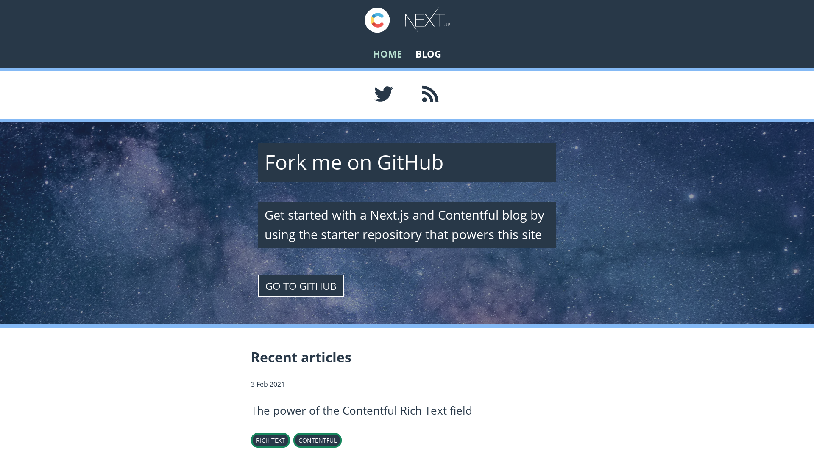
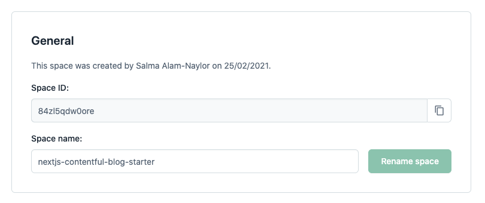
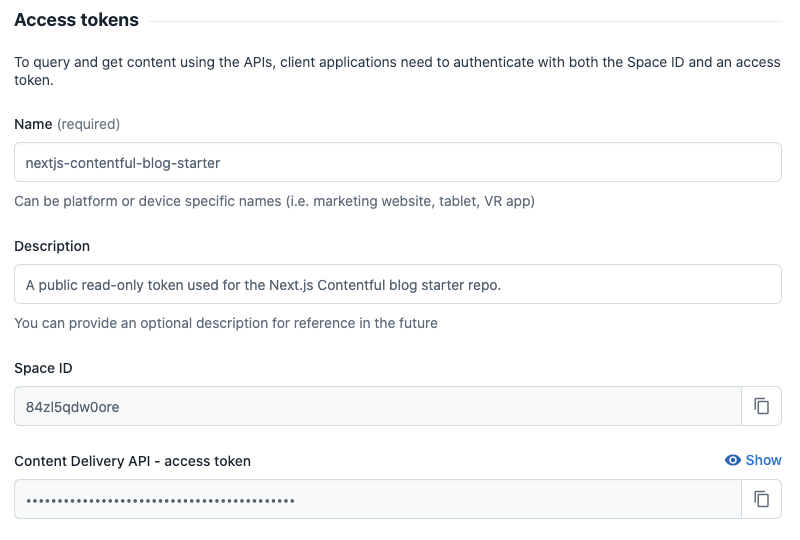
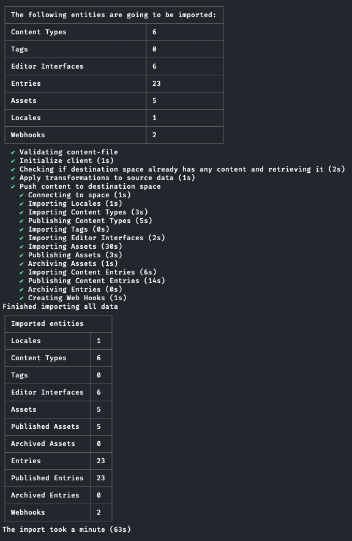
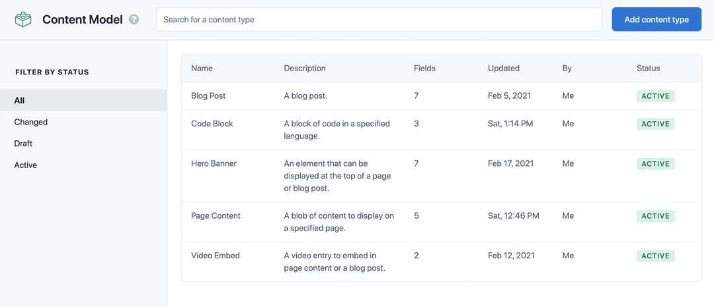

# Next.js + Contentful Blog Starter



This is an example repository for you to use to create a new blog site using Next.js and Contentful, using Contentful's GraphQL API.

[Read more about the GraphQL API](https://graphql.contentful.com).

## View the demo site

[Click here to explore the demo site that uses this repository as its source code.](https://nextjs-contentful-blog-starter.vercel.app/)

## Getting set up

Fork the repository to your GitHub account and clone it to your local machine.

```bash
#using git
git clone git@github.com:whitep4nth3r/nextjs-contentful-blog-starter.git

#using the GitHub CLI
gh repo clone whitep4nth3r/nextjs-contentful-blog-starter
```

## Configuring your development environment

### Install dependencies

In a terminal window, navigate to the project directory and install dependencies with npm.

```bash
cd nextjs-contentful-blog-starter
npm install
```

### Set your environment variables

At the root of the project, create a new `.env.local` file. Add the following environment variable names to the file:

```text
CONTENTFUL_SPACE_ID=
CONTENTFUL_ACCESS_TOKEN=
```

### Using example content from Contentful

**You can choose to use your own Contentful account, or connect to the example space that we've provided.**

If you'd like to view some example content in your development environment to get a feel for how it works, you can use the provided credentials in `env.local.example` which will connect your code to the example space provided by Contentful.

### Using your own Contentful account

To get started with your own Contentful space, [sign up for free](https://www.contentful.com/sign-up/).

Create a new space inside your Contentful account. Go to Settings > General Settings, and make a note of your space ID.



Generate a Content Delivery API access token for your Contentful space.



Add your space ID and access token to your `.env.local` file.

## Importing the starter content model and example content into your own Contentful space

To get started quickly on your own version of the application, you can use the Contentful CLI to import the content model and the example content from the starter into your own Contentful space — without touching the Contentful UI!

### Install the Contentful CLI

```bash
#using homebrew
brew install contentful-cli

#using npm
npm install -g contentful-cli

#using yarn
yarn global add contentful-cli
```

### Authenticate with the CLI

Open a terminal and run:

```bash
contentful login
```

A browser window will open. Follow the instructions to log in to Contentful via the CLI.

### Import the content model and example content

The following command in your terminal, ensuring you switch out SPACE_ID for your new space ID.

```bash
cd nextjs-contentful-blog-starter/setup

contentful space import --space-id SPACE_ID --content-file content-export.json
```

You should see this output in the terminal. The import will take around 1 minute to complete.



Refresh Contentful in your browser, navigate to the content model tab, and you'll find the content types have been imported into your space. You'll find the example content by clicking on the content tab.



## Running the application in development

Navigate to the project directory in a terminal window and run:

```bash
npm run dev
```

## Deploy this site to Vercel

[](https://vercel.com/new/git/external?repository-url=https%3A%2F%2Fgithub.com%2Fwhitep4nth3r%2Fnextjs-contentful-blog-starter)

During the deploy process, add the following environment variables to Vercel. Use the same credentials as you set up in your local development environment.

```text
CONTENTFUL_SPACE_ID
CONTENTFUL_ACCESS_TOKEN
```
